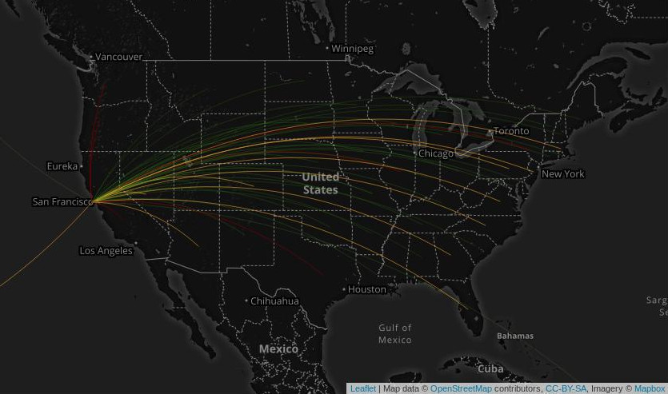

# The Painter and The Cartographer

> Artists map the world the way they see it or the way it strikes them.  The world is aesthetic to artists, and map art abstracts reality aesthetically. -- Dalia Varanka

## Andy Warhol

It was not an accurate map and in the legend provided the icons were so similar that they were undistinguishable.  The point was not to serve a function but instead to make a political and artistic statement.

| USSR Missle Bases | Map of New York City |
|:-----------------:|:--------------------:|
|  |  |

## Paula Scher

> Maps are a supremely satisfying, intuitive way to understand the world—something about connecting information to a sense of place, in context of where we live or what we think we know about our surroundings, is remarkably powerful. Though we tend to expect maps to be purveyors of location-based truths, that's for sure not the only way to experience them.

:no_upscale()/cdn.vox-cdn.com/uploads/chorus_asset/file/6087165/PS_Maps_2015_U.S._Demographics_and_Economy_1.0.jpg)

## David Imus

> He used a computer (not a pencil and paper), but absolutely nothing was left to computer-assisted happenstance. Imus spent eons tweaking label positions. Slaving over font types, kerning, letter thicknesses. Scrutinizing levels of blackness. It’s the kind of personal cartographic touch you might only find these days on the hand-illustrated ski-trail maps available at posh mountain resorts. 

| Conventional Map | Imus Map |
|:--------:|:----------------:|
|  |  |

## Map of Canadian Roads

>Nunavut is really, really isolated. Likely one of the most isolated regions on earth. No roads connecting it to the rest of Canada and even no roads connecting the towns inside of itself.

## So Easy You Can Do It

Below is an example of a GIS project that I am working on.  The aim is to map the flow of people moving out of the Bay Area and see if these people change the economy and culture in their new place of residence.

